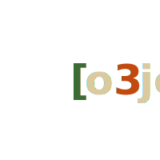

<p align="center">
  
</p>

# o3jc

An Objective-C runtime implemented in Rust, targeting the **GNUstep v2 ABI**. The long-term goal is to execute real Clang-compiled ObjC binaries on Linux.

> **o3jc** because **3** looks like a **b**.

## Status

Early development. Currently implements type system, selector interning, class registry, and slow-path method dispatch. See [`docs/PROGRESS.md`](docs/PROGRESS.md) for details.

## C ABI Surface (Phase 1)

```c
SEL   sel_registerName(const char *name);
char *sel_getName(SEL sel);

Class objc_allocateClassPair(Class superclass, const char *name, size_t extra);
void  objc_registerClassPair(Class cls);
Class objc_getClass(const char *name);
bool  class_addMethod(Class cls, SEL sel, IMP imp, const char *types);
IMP   objc_msg_lookup(id receiver, SEL sel);   // GNUstep-style lookup
```

## Design

See [`docs/PLAN.md`](docs/PLAN.md) for the full architecture. Parked design explorations live in [`docs/ideas/`](docs/ideas/).

## Building

```sh
cargo build
cargo test
```

Requires a stable Rust toolchain (edition 2024, rustc ≥ 1.85).
